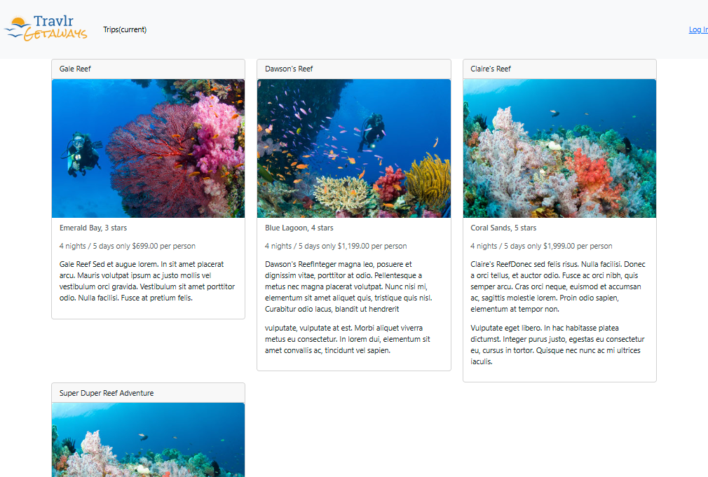
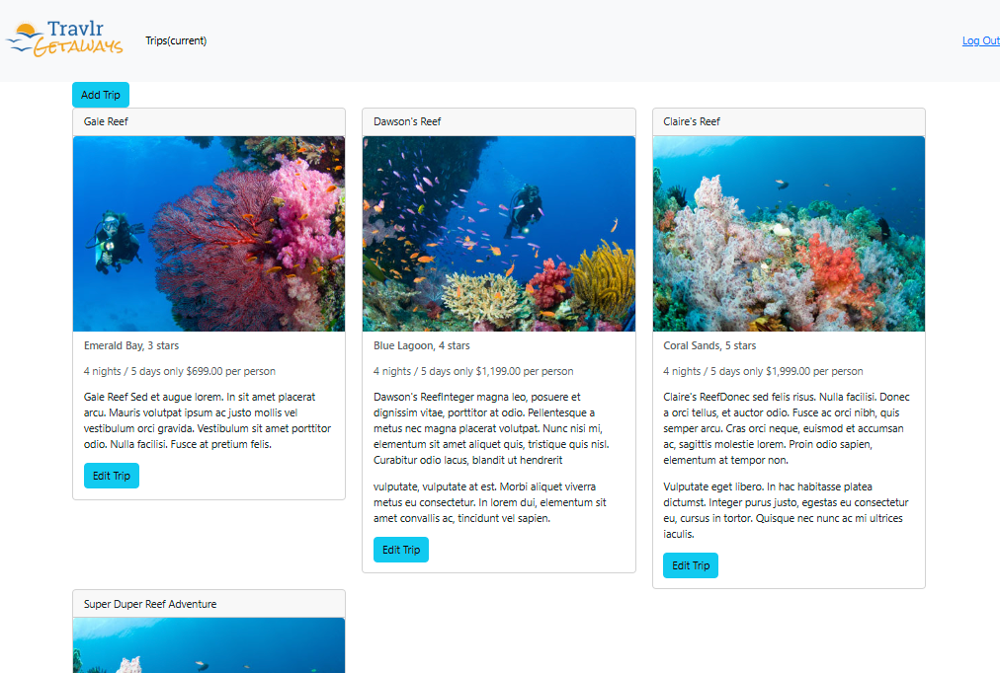

# CS-465-Full-Stack-Development
### Travlr - MEAN Stack (Express.js + Angular.js + MongoDB)
#### Full Stack Web Application
- Features:
  - An admin Single Page Application *SPA* woth login, trip-list, add and update forms
  - REST endpoints for trips and auth
  - Server-rendered customer site (Express + Handlebars)
  - Clean separation of concerns between UI, API, and data
- Prerequisites:
  - Node.js
  - MongoDB
  - Angular CLI for SPA dev (`npm i -g @angular/cli`, if needed)
  - A way to connect to back-end API functions like [Postman](https://www.postman.com/downloads/) or [Insomnia](https://insomnia.rest/download)
- Setup:
  - Install dependencies for root foler and with `npm install`
  - repeat previous step in the app_admin folder of the project
  - Create a `.env` in the root folder and create your JWT_SECRET token
  - run `npm start` from the root folder in your CLI to start the server on localhost:3000
    - this will start the client-facing website 
  - run `ng serve` from the app_admin folder to start the admin server on localhost:4200
    - this will start the admin client SPA
  - register a user using Postman or a similar app as shown below

    
- Test:
  - You should now be able to login to the admin portal at the [Home Screen](http://localhost:4200)
  - When not logged in trips will be available but adding or editing trips will not be possible:
    
  - After succcessful login adding trips and updating existing trips will be available:
     
    
# Architecture, Functionality, and Testing
### Architecture:
- Compare and contrast the types of frontend development used in this project (Express, HTML, JavaScript and the SPA)
  - The server-rendered Express site builds HTML on the server using Handlebars and returns a full page for each navigation. It is SEO frindly but lacks interactivity. Client logic is lightweight JavaScript that adds some interactive elements. The Angular SPA on the other hand, loads once and navigates the client-side using the router. Data is fetched with HTTP calls to the API and views update instantly wihtout requiring a full-page reload. This enables a richer, more responsive UX.
- Why did the backend use a NoSQL MongoDB database?
  - MongoDB's document model maps naturally to JSON objects sent by the SPA and processed by Express which reduces chances of error. Schemas with Mongoose can provide more flexibility than traditional RMDBs, meaning data can be added and manipulated with less retooling of the back-end. Using MongoDB also ensures the stack is tonally JavaScript centric from the front to back (JS/TS on client, Node/Express on server, MongoDB with Mongoose)
 
### Functionality:
- How is JSON different from JavaScript and how does JSON tie together the frontend and backend development pieces?  
  - JavaScript is a **programming language** and JSON is a **data format**. The SPA and API exchange JSON payloads over HTTP. Angular sends/receives JSON, Express parses it and Mogoose validates the JSON stored into the MongoDB database.
- Provide instances in the full stack process when you refactored code to improve functionality and efficiencies, and name the benefits that come from reusable user interface (UI) components.
  - In the `app_server` folder refactoring some HTML elements into *partials* ensures the static site stays consistent from page to page and reduces the amount of raw HTML that needs to be created.
  - Another instance of refactoring happens in the authentication side of the application when creating a method called handleAuthAPIcall. This allows us to avoid duplicating code by calling this method for both the register and login functions and pass the user data to create and return a **JSON Web Token** (JWT).
  - Benefits of refactoring come in the form of fewer bugs because of less code duplication (one source of truth), faster development, and better performace from the app.

 ### Testing: 
 - Explain your understanding of methods, endpoints, and security in a full stack application.
   - `GET`, `POST`, `PUT`, and `DELETE` are the common CRUD methods used in many full stack applications to retrieve and manipulate data which updates the views.
   - Clear and understanble routes make up the endpoints of the SPA
   - Security in the case of this project is handled with a JWT which is issued at the time of login. Protected routes require `Authorization: Bearer <token>`. 
  
# Reflection
Completing this project has helped me solidify the core concepts of implementing a full MEAN stack application. By designing and building both the RESTful APIs and the Angular single-page application, I gained hands-on experience with JavaScript on the backend and the Angular framework on the frontend. Developing reusable components, refactoring the codebase, and applying TypeScript for stronger typing gave me practical insight into how these tools work together to create a dynamic, reactive, and maintainable web application.

This project also reinforced the importance of version control and collaborative workflows. I became more comfortable branching, testing, and merging code into the main branch, which mirrors real-world practices used in professional development teams. Overall, the experience has not only deepened my technical understanding of APIs, SPAs, and full-stack architecture, but also increased my confidence in contributing effectively to a team environment where code quality, testing, and maintainability are critical. 
